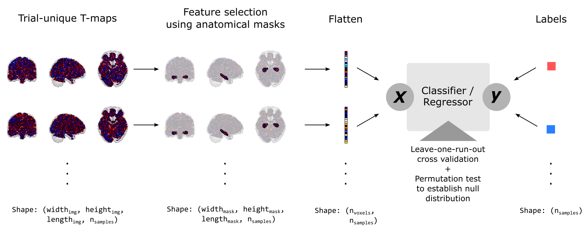

# PavPE-MVPA

[](https://github.com/RichardLitt/standard-readme)

An fMRI-MVPA implementation based on [nilearn](https://github.com/nilearn/nilearn) and [scikit-learn](https://github.com/scikit-learn/scikit-learn).

Performs a multi-voxel pattern analysis (MVPA) on preprocessed fMRI data using leave-one-run-out cross validation and evaluates model performance against the null distribution obtained through permutation testing.

## Table of Contents

- [Background](#background)
	- [References](#references)
- [Install](#install)
	- [Data preparation](#data-preparation)
	- [Anatomical masks](#anatomical-masks)
	- [Configuration](#configuration)
- [Usage](#usage)
- [Contributing](#contributing)
- [License](#license)

##  Background

This project implements a multi-voxel pattern analysis (MVPA; Norman et al., 2006) that mirrors the approach used in Kalbe and Schwabe (2020). In contrast to more traditional, mass-univariate approaches to the analysis of functional magnetic resonance imaging (fMRI) data, MVPAs consider patterns of activity between multiple voxels to predict psychological or behavioral variables. Essentially, an MVPA consists of extracting voxel-wise activity (features) and observed values of the target variable (labels) and feeding them to common machine learning algorithms. This technique can be applied to both categorical target variables (classification, e.g., whether an item was later successfully recognized) and continuous target variables (regression, e.g., the extend of perceptual prediction errors). 

Compared with many other applications of machine learning to real-world data, the analysis of functional brain data comes with some unique challenges. Not only are fMRI data relatively noisy, but they also suffer from temporal autocorrelation which can cause overly optimistic results. To mitigate the later issue, we record data over multiple runs with pauses in between. During training, we then apply leave-one-run-out cross validation, where one run is used to evaluate the performance of a model trained on the remaining runs.

Another serious issue is the severe disparity between the number of features, corresponding with the number of voxels in each functional image, and the number of samples, corresponding with the number of recorded trials. A typical functional image of the whole brain contains tens of thousands of unique voxels (i.e., features) while a typical behavioral experiment will at maximum consist of a few hundred trials (i.e., labels). This issue can be reduced by only considering voxels from specific anatomical brain regions based on theoretical knowledge of their involvement in critical neural processes (i.e., theory-driven feature selection). Even then, depending on the size of these regions of interest (ROIs), the number of remaining features will still typically exceed the number of samples. This requires machine learning algorithms that are very robust to overfitting. In practice, regularized SVMs have proven to work relatively well in most cases.

In this MVPA implementation, we do not use a separate training set to evaluate our model's performance because this would require further reducing the size of our most likely already tiny training set. Instead, we evaluate our model's performance using permutation testing (Combrisson et al., 2015), which works by randomly permutating labels to establish the null distribution. Comparing classification performance on original vs. permutated labels allows us to calculate p-values for the null hypothesis that the model only found random structure in the data.

A simplified summary of our MVPA approach is depicted below:


### References
- Combrisson, E., & Jerbi, K. (2015). Exceeding chance level by chance: The caveat of theoretical chance levels in brain signal classification and statistical assessment of decoding accuracy. Journal of Neuroscience Methods, 250, 126-136. https://doi.org/10.1016/j.jneumeth.2015.01.010
- Kalbe, F., & Schwabe, L. (2021). Prediction errors for aversive events shape long-term memory formation through a distinct neural mechanism. bioRxiv. https://doi.org/10.1101/2021.03.19.436177
- Norman, K. A., Polyn, S. M., Detre, G. J., & Haxby, J. V. (2006). Beyond mind-reading: multi-voxel pattern analysis of fMRI data. Trends in Cognitive Sciences, 10(9), 424-430. https://doi.org/10.1016/j.tics.2006.07.005


## Install

This project was tested with Python 3.10.0. Additionally, it requires [nilearn](https://github.com/nilearn/nilearn) (tested with version 0.8.1) and its dependencies to be installed.

Afterwards, navigate your shell to an appropriate directory and clone the git repository using:
```
git clone https://github.com/fkalbe/PavPE-MVPA.git
```

### Data preparation

Before running the analysis, behavioral and fMRI data for each participant need to be placed under the `data/` folder. Place a folder for each participant named with their unique identifier that must start with `VP_`. Each participant folder must contain the two subfolders `behavioral/` and `mvpa/`. The `behavioral/` subfolder should contain a single csv file of trial-wise behavioral data of this participant, including a header with variable names that need to be referenced in the configuration file (see below). The `mvpa/` subfolder should contain one or more subfolders corresponding with time windows relative to a reoccuring reference event (e.g., trial outcome) named `sec_[T]`, where `[T]` must be replaced with a corresponding signed integer. In each of these folders, place one T-map per trial in the .nii format that reflects the normalized voxel-wise trial-unique activation. These T-maps should follow the SPM naming convention (`spmT_0001.nii`, `spmT_0002.nii`, etc.).

### Anatomical masks

You need to supply your own anatomical masks in `.nii` format in the `atlas/` folder. Afterwards, edit `mask_defs.yaml` in the project's root directory and reference these mask definitions in the configuration file.

### Configuration

To define ROIs, preprocessing steps, and a list of models with their hyperparameters, edit `config.yaml` in the project's root directory.

## Usage

To run the analysis, navigate your shell to the project's root directory and run `python run_mvpa.py`. Results are automatically saved in a `results/` directory.

```
usage: run_mvpa.py [-h] [--config CONFIG]

Runs Multivariate Pattern Analysis(MVPA) on preprocessed fMRI data.

options:
  -h, --help          show this help message and exit
  --config CONFIG, -c CONFIG
                      Custom config file. Will use /config.yaml if not set.
```

## Contributing

Feel free to open an issue or submit a PR :)

## License

[MIT](/LICENSE) © Felix Kalbe
